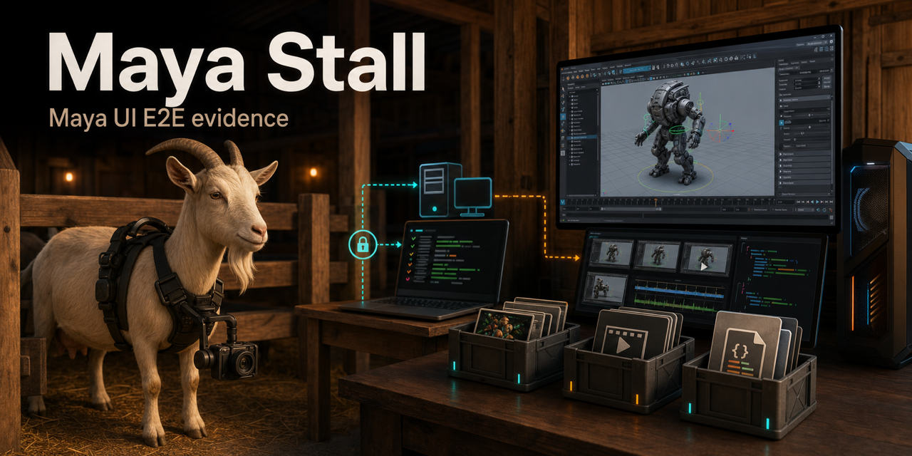

# Maya Stall

[](https://github.com/BramVR/gg_maya_stall/actions/workflows/ci-required.yml)
[](go.mod)

**Run real Autodesk Maya UI Scenarios from repo-owned config.**

Maya Stall is a Go CLI for end-to-end checks that must happen inside an
interactive Autodesk Maya desktop. It lets a consuming repo declare named
Scenarios, stage only the required payload paths, run those Scenarios on an
owned Maya Host, collect visual and structured evidence, and publish a review
comment with links to the result.

```sh
maya-stall run smoke
```

Behind that command, Maya Stall loads repo config, selects a Target Profile and
Maya Host, stages the Run Payload, asks the Session Broker to run the Scenario
inside Maya, captures an Evidence Bundle, runs Validators, and cleans up or
keeps the session according to the Stop Policy.

The default Embedded Mode owns that lifecycle in the current checkout. An
optional Configured Control Plane Mode submits the same repo-owned Scenario and
declared payload snapshot to an authenticated HTTPS service without changing
Repo Run Config. The Control Plane can execute a fake or Agent-configured real
Scenario through one registered Windows Host Agent over an outbound
authenticated connection. Agents publish fresh versioned Host capability
records so planning and Control Plane scheduling can apply the same exact or
minimum version and required-feature compatibility decision before assignment.

## Who Maya Stall Is For

Maya Stall fits teams that maintain Maya plugins, tools, or scenes where a
headless check is not enough:

- plugin maintainers who need proof that a build loads and behaves in real Maya;
- CI maintainers who own Windows Maya Hosts and want deterministic UI evidence;
- Scenario authors who want repo-owned scripts, outputs, and Validators without
  storing host credentials in the repo;
- reviewers who need screenshots, logs, metadata, and structured
  Scenario Results linked from normal code review.

Use Maya Stall for owned-host Maya UI proof. Do not use it as a generic remote
execution runner, a CI replacement, a secrets store, or a security boundary
between untrusted users.

## How It Works

```text
consuming repo              maya-stall CLI             Windows Maya Host
-------------               --------------             -----------------
.maya-stall.yaml  ----->    select Scenario      SSH   clean run workspace
payload paths                stage payload       ---->  Session Broker
validators                   collect evidence    <----  Maya UI Session
review target                publish comment            screenshots
```

- **CLI** - Go binary under `cmd/maya-stall`. Owns config loading, Scenario
  selection, Host Pool selection, payload staging, evidence layout, Validators,
  publishing, and Review Comments.
- **Consuming repo** - owns non-secret Repo Run Config, Maya Scripts, scenes,
  Plugin Artifacts, Expected Outputs, and domain-specific assertions.
- **Maya Host** - an owned Windows machine with Autodesk Maya, OpenSSH, an
  interactive desktop, a writable work root, and a Session Broker such as
  `gg_mayasessiond`.
- **Evidence Store** - a filesystem or network location where completed Evidence
  Bundles are copied and made linkable from review comments.

Crabbox is a reference for remote execution, stop policy, desktop evidence, and
artifact discipline, but Maya Stall is Maya-specific and does not require the
Crabbox binary at runtime.

## Quick Start

```sh
go test ./...
mkdir -p bin
go build -o bin/maya-stall ./cmd/maya-stall
./bin/maya-stall --help
```

Create repo-only config:

```sh
maya-stall init
```

Run the generated fake Scenario:

```sh
maya-stall plan smoke
maya-stall doctor --scenario smoke
maya-stall run smoke
maya-stall evidence collect smoke
```

To route the fake Scenario through a configured Control Plane, set its bearer
token in `MAYA_STALL_CONTROL_PLANE_TOKEN` and pass an origin-only HTTPS URL:

```sh
maya-stall run --control-plane https://maya-stall.example.com smoke
maya-stall status --control-plane https://maya-stall.example.com --json --run <run-id>
maya-stall events --control-plane https://maya-stall.example.com <run-id>
maya-stall attach <run-id> --control-plane https://maya-stall.example.com --from-sequence 1
maya-stall history --control-plane https://maya-stall.example.com --json
maya-stall logs --control-plane https://maya-stall.example.com <run-id>
maya-stall result --control-plane https://maya-stall.example.com <run-id>
```

Capture standalone Visual Evidence:

```sh
maya-stall screenshot
maya-stall record
```

Maya Stall v1 supports screenshot and recording Visual Evidence. On real SSH
Windows Maya Hosts, `maya-stall record` captures desktop frames from the
interactive Windows Maya session and encodes `recordings/recording.mp4` locally
with `ffmpeg`.

Prepare real hosts with the
[Windows Maya Host setup checklist](docs/setup/windows-maya-host.md), then keep
Host Pools, hostnames, SSH keys, Windows users, license details, Session Broker
paths, and Evidence Store paths outside `.maya-stall.yaml`.

## Docs

Start with [Maya Stall Docs](docs/README.md), then read:

- [Getting started](docs/getting-started.md)
- [CLI overview](docs/cli.md)
- [Command reference](docs/commands/README.md)
- [Concepts and glossary](docs/concepts.md)
- [Changelog](CHANGELOG.md)
- [Release checklist](docs/RELEASING.md)
- [Windows Maya Host setup](docs/setup/windows-maya-host.md)
- [Source map](docs/source-map.md)

Architectural decisions live in [docs/adr](docs/adr/). The v1 product shape is
captured in [docs/prd/0001-maya-stall-v1.md](docs/prd/0001-maya-stall-v1.md).
